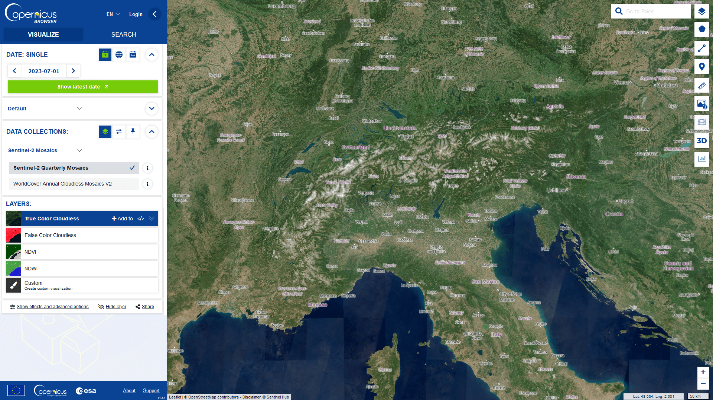

## About

[Copernicus Browser](https://browser.dataspace.copernicus.eu/) is a search tool for satellite imagery, including Sentinel-1, 2, 3 and 5P. It was released as open-source to bring Earth Observation imagery closer to end users.

Some features:

- Search by date, location, source, and cloud cover
- Tweak imagery rendering parameters and settings on-the-fly and download beautiful visualisations of the data
- Search full products and download raw data (individual files or entire products)
- Add products to the workspace for further processing
- Pin your results and make opacity or split image comparisons
- Explore imagery in 3D
- Create and share 2D/3D timelapses
- Analyse the visualised data (measure, statistics, histogram)

The use of Copernicus Browser is free of charge. To unlock advanced features, you need to create a free account ([here](https://identity.cloudferro.com/auth/realms/CDSE/protocol/openid-connect/auth?client_id=sh-5f8b63-YOUR-INSTANCEID-HERE&redirect_uri=https%3A%2F%2Fdataspace.copernicus.eu%2Fbrowser%2FoauthCallback.html&response_type=token&state=)).

Copernicus Browser is part of the Copernicus Data Space Ecosystem, a new service for better access to and use of data from the EU's Copernicus satellites. You can find out more about the service [here](https://dataspace.copernicus.eu/about) and in the Copernicus Browser user manual [here](https://documentation.dataspace.copernicus.eu/Applications/Browser.html) you will find a detailed overview of the Browser's functionality.

Sentinel-2 Quarterly Mosaic for June - August in a True Color visualisation ([link](https://link.dataspace.copernicus.eu/0im))

## Development

### Requirements

- `node` version >= 18
- `npm` version >= 10

### Local development

- copy the file `.env.example` and rename the copied file to `.env`, fill out the needed values
- use your instance ids in `*_themes.js`
- Run `npm install`
- Run `npm start` to run the application locally (opens a web browser tab on `http://localhost:3000` and resfreshes the app when any of the .js files are changed)
- Run `npm run prettier` to prettify `js`, `json`, `css` and `scss` files
- Run `npm run lint` to lint `js`, `json`, `css` and `scss` files
- Run `npm run build` to build the application sources
- Run `npm run translate` to add strings to the translation files
- Run `npm run debug-translations` to replace all translation strings with "XXXXXX"
- Run `npm run update-previews` to create layer preview images
- Run `npm run update-metadata-cache` to create getCapabilities and configuration cache

### Building the application

- Run `npm run build`
- Use the generated `build` directory - for instance, you can run a simple python server `python -m http.server 3000` or deploy it to your preferred server

### Environment variables in the .env file

The app relies on some values being provided as environment variables. The details are described in the collapsible section below.

  
Click to expand

#### Mandatory

- `VITE_ROOT_URL`: URL at which the app is (publicly) accessible

  - Needed for correctly setting URLs for assets and authentication.
  - `http://localhost:3000/` for local development, the whole public url for deployments on web servers

- `VITE_SH_SERVICES_URL`: URL at which the Sentinel Hub servicess are accessible

  - `https://sh.dataspace.copernicus.eu`

- OData API endpoints:
  - `VITE_CDAS_ODATA_SEARCH_URL`: `https://catalogue.dataspace.copernicus.eu/odata/v1/` (documentation [here](https://documentation.dataspace.copernicus.eu/APIs/OData.html))
  - `VITE_CDAS_ODATA_DOWNLOAD_URL`: `https://zipper.dataspace.copernicus.eu/odata/v1/` (documentation [here](https://documentation.dataspace.copernicus.eu/APIs/OData.html))

Application supports usage with user login or anonymously (without having to log in).
In case of anonymous usage, the instance ids in `default_themes.js` and `education_themes.js` need to be set.
The service endpoint that provides access tokens to anonymous users needs to be implemented and run on your own.
In a nutshell this endpoint:

- Uses client credentials grant to acquire a token from CDSE identity provider and returns it to the caller
- Tries to prevent abuse of this endpoint by:
  - Doing it's best to differentiate requests originating from real users vs scripts or bots (by using various fingerprinting mechanisms such as recaptcha, ....)
  - Prevents overuse through request rate limiting

Environment variables neede for user login:

- `VITE_AUTH_BASEURL`: Base URL for user login (https://identity.dataspace.copernicus.eu/, documentation [here](https://documentation.dataspace.copernicus.eu/APIs/SentinelHub/Overview/Authentication.html#oauth2-endpoints))
- `VITE_CLIENTID`: ID of the OAuth client created in the [Dashboard](https://shapps.dataspace.copernicus.eu/dashboard/) and designated for user login
  - create your OAuth client in the [Dashboard](https://shapps.dataspace.copernicus.eu/dashboard/)

Environment variables needed for anonymous usage:

- `VITE_CAPTCHA_SITE_KEY`: Google Captcha site key for anonymous authentication (to enable usage without user login)
- `VITE_ANON_AUTH_SERVICE_URL`: URL for anonymous authentication (to enable usage without user login)

#### Optional

- `VITE_CDSE_BACKEND`: Backend for saving user pins and timelapses

  - without it, users won't be able to save pins without downloading them or share
  - represents a simple backend which saves pins as an object to a postgres database
  - GET endpoint for retrieving user's pins
  - PUT endpoint for saving and updating user's pins

  - `VITE_REBRANDLY_API_KEY`: URL shortener
    - add it to your backend enviroment variables
    - create your account on [Rebrandly's website](https://www.rebrandly.com/)
    - without it, users won't be able to share the short URL (copying long URL will still work)

- `VITE_GOOGLE_TOKEN`: Google Maps API key for location search
  - see [Google's documentation](https://developers.google.com/maps/documentation/javascript/get-api-key)
  - without it, users won't be able to use Google for location search
- `VITE_GOOGLE_MAP_KEY`: Google Maps API key for Google satellite baselayer
  - see [Google's documentation](https://developers.google.com/maps/documentation/javascript/get-api-key)
  - without it, there will be no Google Satellite basemap for paying users

#### Optional, for maintenance

- `APP_ADMIN_CLIENT_ID`: ID of the OAuth client created in the [Dashboard](https://shapps.dataspace.copernicus.eu/dashboard/) and used for updating configurations cache and preview images
  - see [Sentinel Hub on Copernicus Dataspace Ecosystem documentation](https://documentation.dataspace.copernicus.eu/APIs/SentinelHub/Overview/Authentication.html)
  - without it, maintainers won't be able to update configurations cache and preview images
- `APP_ADMIN_CLIENT_SECRET`: Secret of the OAuth client created in the [Dashboard](https://shapps.dataspace.copernicus.eu/dashboard/) and used for updating configurations cache and preview images
  - see [Sentinel Hub on Copernicus Dataspace Ecosystem documentation](https://documentation.dataspace.copernicus.eu/APIs/SentinelHub/Overview/Authentication.html)
  - without it, maintainers won't be able to update configurations cache and preview images
- `APP_ADMIN_AUTH_BASEURL`: Auth URL to authenticate with client id and secret for updating configurations cache and preview images
  - `https://identity.dataspace.copernicus.eu/auth/realms/CDSE/protocol/openid-connect/token`
  - see [Copernicus Dataspace Ecosystem documentation](https://documentation.dataspace.copernicus.eu/APIs/Token.html)
  - see [Sentinel Hub on Copernicus Dataspace Ecosystem documentation](https://documentation.dataspace.copernicus.eu/APIs/SentinelHub/Overview/Authentication.html)
  - without it, maintainers won't be able to update configurations cache and preview images

## Multilanguage support

Thanks to the efforts of various people and institutions, you can use the Copernicus Browser in your native language. Since the Browser is under constant development, not all parts might be already translated in all languages.

Your language is missing or incomplete and you want to help with the translation? Contact us at translation_support@sinergise.com for more information.

Copernicus Browser, the evolution of EO Browser, shares many translations with its predecessor. A big thank you to everyone listed below (including those who didn't want to be publicly named) for their help in translating parts of the respective app.

#### Wall of fame:

- Catalan: Ferran Gascon ([ESA](https://www.esa.int/))
- Dutch: Bram Janssen, Bart Bomans ([VITO](https://remotesensing.vito.be/))
- German: ESERO Austria/ESERO Germany
- French: [CNES](https://cnes.fr/en), ESERO France, ESERO Luxembourg
- Hungarian: Beata Malyusz, András Zlinszky
- Italian: Annamaria Luongo, Giuseppe Petricca, Stefano Ippoliti
- Latvian: Valters Žeižis
- Lithuanian: [National Paying Agency](https://lrv.lt/lt/) (Ministry of Agriculture)
- Polish [ESERO Poland](https://esero.kopernik.org.pl/)/[Copernicus Science Centre](https://esero.kopernik.org.pl/)
- Slovenian: Krištof Oštir ([Faculty of Civil and Geodetic Engineering](https://www.en.fgg.uni-lj.si/), University of Ljubljana)
- Spanish: ESERO Spain, Jorge Delgado ([University of Jaén](https://www.ujaen.es/en))
- Ukrainian: [GIS & RS Laboratory of Junior Academy of Sciences of Ukraine](https://man.gov.ua/en/)

#### Disclaimer

The translations in Copernicus Browser are a community effort and are largely provided on a voluntary basis. As the application contains several hundred translations per language, we cannot guarantee the accuracy of every single translation.
