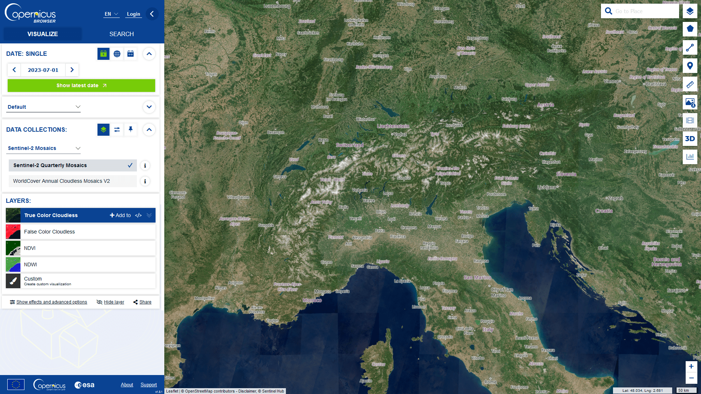

## About

The [Copernicus Browser](https://dataspace.copernicus.eu/browser/) is a search tool for satellite imagery, including Sentinel-1, 2, 3 and 5P. It was released as open-source to bring earth observation imagery closer to its end users.

Some features:

* Search by date, location, source, and cloud coverage
* Tweak imagery rendering parameters and settings on-the-fly
* Pin your results and make opacity or split image comparisons
* Use Copernicus account

Contact us to get help about deploying the Browser on your infrastructure.

## Development

* copy `.env.example` file and rename the copied file to `.env`, fill out the needed values
* use your instance ids in `*_themes.js`
* Run `npm install`
* Run `npm start` to run the application locally
* Run `npm run storybook` to run storybook locally for testing components independently
* Run `npm run prettier` to prettify `js`, `json`, `css` and `scss` files
* Run `npm run lint` to lint `js`, `json`, `css` and `scss` files
* Run `npm run build` to build the application sources
* Run `npm run translate` to add strings to the translation files
* Run `npm run debug-translations` to replace all translation strings with "XXXXXX"
* Run `npm run update-previews` to create layer preview images
* Run `npm run update-metadata-cache` to create getCapabilities and configuration cache

## Multilanguage support

Thanks to the efforts of various people and institutions, you can use the Copernicus Browser in your native language. Since the Browser is under constant development not all parts might be already translated in all languages.

Your language is missing or incomplete and you want to help with the translation? Contact us at megha.devaraju@sinergise.com for more information.

Copernicus Browser, the evolution of EO Browser, shares many translations with its predecessor. A big thank you to everyone listed below (including those who didn't want to be publicly named) for their help in translating parts of the respective app.

#### Wall of fame:
- German: ESERO Austria/ESERO Germany
- French: [CNES](https://cnes.fr/en), ESERO France, ESERO Luxembourg