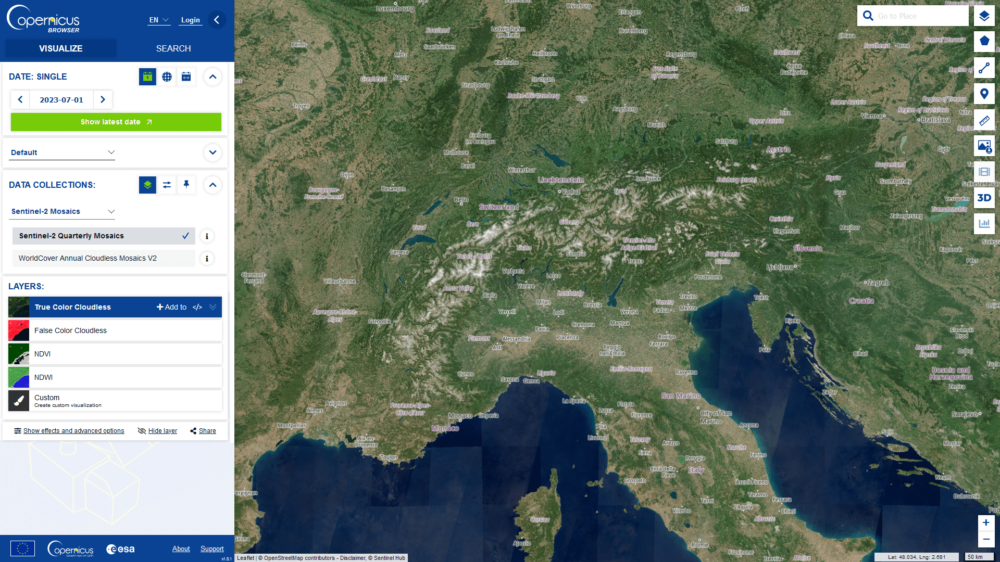

## About

[Copernicus Browser](https://browser.dataspace.copernicus.eu/) is a search tool for satellite imagery, including Sentinel-1, 2, 3 and 5P. It was released as open-source to bring Earth Observation imagery closer to end users.

Some features:

- Search by date, location, source, and cloud cover
- Tweak imagery rendering parameters and settings on-the-fly and download beautiful visualisations of the data
- Search full products and download raw data (individual files or entire products)
- Add products to the workspace for further processing
- Pin your results and make opacity or split image comparisons
- Add third-party WMS/WMTS map services and visualise their layers alongside Copernicus data (only the service URL and metadata are stored; its layer list is fetched from the service on demand each session)
- Explore imagery in 3D
- Create and share 2D/3D timelapses
- Analyse the visualised data (measure, statistics, histogram)

The use of Copernicus Browser is free of charge. To unlock advanced features, you need to create a free account ([here](https://identity.cloudferro.com/auth/realms/CDSE/protocol/openid-connect/auth?client_id=sh-5f8b63-YOUR-INSTANCEID-HERE&redirect_uri=https%3A%2F%2Fdataspace.copernicus.eu%2Fbrowser%2FoauthCallback.html&response_type=token&state=)).

Copernicus Browser is part of the Copernicus Data Space Ecosystem, a new service for better access to and use of data from the EU's Copernicus satellites. You can find out more about the service [here](https://dataspace.copernicus.eu/about) and in the Copernicus Browser user manual [here](https://documentation.dataspace.copernicus.eu/Applications/Browser.html) you will find a detailed overview of the Browser's functionality.

Sentinel-2 Quarterly Mosaic for June - August in a True Color visualisation ([link](https://link.dataspace.copernicus.eu/0im))

## Development

### Requirements

- `node` version >= 22
- `npm` version >= 10

### Local development

- copy the file `.env.example` and rename the copied file to `.env`, fill out the needed values
- use your instance ids in `*_themes.js`
- Run `npm install`
- Run `npm start` to run the application locally (opens a web browser tab on `http://localhost:3000` and resfreshes the app when any of the .js files are changed)
- Run `npm run prettier` to prettify `js`, `json`, `css` and `scss` files
- Run `npm run lint` to lint `js`, `json`, `css` and `scss` files
- Run `npm run prettier-check` to verify formatting without modifying files (this is what the pre-commit hook runs)
- Run `npm run build` to build the application sources
- Run `npm run translate` to add strings to the translation files
- Run `npm run debug-translations` to replace all translation strings with "XXXXXX"
- Run `npm run update-metadata-cache` to create getCapabilities and configuration cache
- Run `npm run update-rrd-configurations` to create getCapabilities and configuration cache for the RRD collections

`npm install` installs a [husky](https://typicode.github.io/husky/) pre-commit hook (`.husky/pre-commit`) that runs
`npm run lint` and `npm run prettier-check` in parallel and rejects the commit if either fails. Run `npm run prettier`
to auto-fix formatting errors. To bypass the hook for a single commit use `git commit --no-verify`; to disable husky
for a shell session use `HUSKY=0`.

### Dependency security

`npm install` will never be fully clean of `npm audit` findings: some transitive dependencies have no
upstream fix yet, and some fixes would require a breaking version bump that is deliberately deferred to
a separate follow-up issue. `package.json` uses the `overrides` field to force safe versions of
transitive dependencies where no direct upgrade path exists. Each entry should be removed once its
condition is met — check `npm audit` after removing an entry to confirm the underlying advisory is
still resolved before dropping it:

| Override                      | Reason                                                                                                                                                                                                                                                                                                                                                                                                                                                                         | Removal condition                                                                                            |
| ----------------------------- | ------------------------------------------------------------------------------------------------------------------------------------------------------------------------------------------------------------------------------------------------------------------------------------------------------------------------------------------------------------------------------------------------------------------------------------------------------------------------------ | ------------------------------------------------------------------------------------------------------------ |
| `lodash: 4.18.1`              | Clears a `lodash` high-severity advisory (code injection, prototype pollution) pulled in by `jshint` (via `@sentinel-hub/evalscript-code-editor`). `jshint` declares `~4.17.21`, so this forces a version outside its declared range. Only affects the top-level `lodash` package; it does not touch the separately-published `lodash.clonedeep`, `lodash.merge`, `lodash.round`, `lodash.values` packages this app imports directly, which stay pinned to their own versions. | Drop once `@sentinel-hub/evalscript-code-editor` ships a jshint-free or updated-jshint release.              |
| `minimatch@<3.1.5: 3.1.5`     | Clears `minimatch` high-severity ReDoS advisories via the same `jshint` chain. `jshint` declares `~3.0.2`; `3.1.x` is API-compatible with `3.0.x`.                                                                                                                                                                                                                                                                                                                             | Same as above.                                                                                               |
| `babel-plugin-macros: ^3.1.0` | Clears the `ERESOLVE` peer-dependency warning on every install (`dedent` wants `^3.1.0`, `babel-plugin-ttag` pins `^2.8.0`).                                                                                                                                                                                                                                                                                                                                                   | Drop once `ttag-cli` is upgraded to a version whose `babel-plugin-ttag` depends on `babel-plugin-macros ^3`. |
| `exceljs.uuid: ^11.1.1`       | Clears a moderate `uuid` advisory pulled in by `exceljs` (dev-only, see accepted risks below for why it isn't actually reachable).                                                                                                                                                                                                                                                                                                                                             | Drop once `exceljs` ships with `uuid v11+` natively.                                                         |

An override for the moderate `ajv` ReDoS advisory (via `babel-plugin-ttag`, which pins `ajv` to an
exact `6.12.3`) was deliberately **not** added: forcing it required a full `node_modules` +
`package-lock.json` wipe to dedupe reliably, and that wipe also re-resolved unrelated, loosely-pinned
devDependencies (e.g. bumped `@types/react` past a version this codebase type-checks cleanly against).
That side effect is worse than the advisory itself, since `ajv` here only runs inside `babel-plugin-ttag`,
a dev-only tool used solely by `npm run translate`. It is tracked as an accepted risk below instead.

If an override is ever suspected of masking a real resolution problem, delete `node_modules` and
`package-lock.json` and run `npm install` twice in a row (a single pass can leave a nested copy
un-deduped), then re-run `npm audit`.

`src/junk/EOBAdvancedHolder/evalscriptJshint.test.ts` runs the forced `lodash` override through
`jshint`'s actual `JSHINT()` entry point (the same function and options
`@sentinel-hub/evalscript-code-editor`'s `CodeEditor` uses to lint evalscripts), so a lodash version
outside the range `jshint` declares is exercised on every `npm test` run instead of relying on a manual
UI check. This is treated as sufficient automated coverage of that override; a manual check of the
CodeEditor's syntax highlighting and lint markers in the running app is not required before merging
changes that only touch these overrides. The `minimatch` override has no automated coverage, since
`jshint` only requires `minimatch` from its CLI's `--exclude` glob handling (`src/cli.js`), a code path
`JSHINT()` never reaches and this app never invokes.

The following `npm audit` findings are intentionally left unfixed, with the evidence for why they are
not exploitable in this app:

- **`ajv` via `babel-plugin-ttag` (GHSA-2g4f-4pwh-qvx6)** - a ReDoS when using the `$data` option.
  `babel-plugin-ttag` only uses `ajv` to validate its own static config schema at build time, as part of
  `npm run translate` tooling; it never processes attacker-controlled input. See the note above for why
  this isn't overridden.
- **`fast-xml-parser` (GHSA-gh4j-gqv2-49f6)** - the advisory is an `XMLBuilder` CDATA/comment injection.
  `XMLBuilder` is not imported anywhere in this app, nor inside `@sentinel-hub/sentinelhub-js`'s bundle
  (which only uses `XMLParser`). The app only ever parses XML, never builds it.
- **`uuid` via `exceljs` (GHSA-w5hq-g745-h8pq)** - the advisory is a missing buffer bounds check in
  `v3`/`v5`/`v6` when a `buf` argument is supplied. `exceljs` calls only `uuid v4`. `exceljs` is also a
  devDependency used solely by the manual admin script `scripts/private-collection-access-share.ts`, never
  bundled and never run in CI.
- **`elliptic` (GHSA-848j-6mx2-7j84)** - the advisory range is `<=6.6.1`, and `6.6.1` is the latest
  published version, so no fixed release exists yet. It is pulled in by `vite-plugin-node-polyfills`, a
  build-time browser polyfill (`nodePolyfills()` called with default options in `vite.config.mts`), so
  it is not attacker-reachable at runtime.

Remaining moderate/low findings from `react-router` require a major version bump (v6 to v7) and are
tracked as a separate follow-up issue rather than fixed here.

CI previously ran `npm audit --audit-level=high` as part of `install_packages_and_run_lint`, but a
newly published advisory (unrelated to the changes in a given MR) could fail that required job and
block merging, so the check was removed (see #1265). It will come back as a separate, non-blocking
job (#1266).

### Building the application

- Run `npm run build`
- Use the generated `build` directory - for instance, you can run a simple python server `python -m http.server 3000` or deploy it to your preferred server

### Analytics (Fathom event tracking)

The app loads [Fathom Analytics](https://usefathom.com/) as a deferred third-party script (see `index.html`), so `window.fathom` is undefined until it loads and permanently undefined when blocked by an ad blocker. Custom events are tracked through the guarded `handleFathomTrackEvent(event, value?)` helper in `src/utils/fathom.ts`, which optional-chains the call and swallows any error, so a blocked or failing Fathom never breaks the user action it's attached to. Event names are centralised in `FATHOM_TRACK_EVENT_LIST` in `src/const.ts`; when a value is passed it is appended as `"${event}: ${value}"`, matching Fathom's wildcard event grouping (e.g. `External service added: *`).

Currently tracked events cover the external WMS/WMTS layers feature: opening the panel, adding a service (success/failure with a reason code), selecting an external layer, and adding an external layer to Pins or Compare.

### Environment variables in the .env file

The app relies on some values being provided as environment variables. The details are described in the collapsible section below.

  
Click to expand

#### Mandatory

- `VITE_ROOT_URL`: URL at which the app is (publicly) accessible

  - Needed for correctly setting URLs for assets and authentication.
  - `http://localhost:3000/` for local development, the whole public url for deployments on web servers

- `VITE_SH_SERVICES_URL`: URL at which the Sentinel Hub servicess are accessible

  - `https://sh.dataspace.copernicus.eu`

- OData API endpoints:
  - `VITE_CDAS_ODATA_SEARCH_URL`: `https://catalogue.dataspace.copernicus.eu/odata/v1/` (documentation [here](https://documentation.dataspace.copernicus.eu/APIs/OData.html))
  - `VITE_CDAS_ODATA_DOWNLOAD_URL`: `https://zipper.dataspace.copernicus.eu/odata/v1/` (documentation [here](https://documentation.dataspace.copernicus.eu/APIs/OData.html))

Application supports usage with user login or anonymously (without having to log in).
In case of anonymous usage, the instance ids in `default_themes.js` need to be set.
The service endpoint that provides access tokens to anonymous users needs to be implemented and run on your own.
In a nutshell this endpoint:

- Uses client credentials grant to acquire a token from CDSE identity provider and returns it to the caller
- Tries to prevent abuse of this endpoint by:
  - Doing it's best to differentiate requests originating from real users vs scripts or bots (by using various fingerprinting mechanisms such as recaptcha, ....)
  - Prevents overuse through request rate limiting

Environment variables neede for user login:

- `VITE_AUTH_BASEURL`: Base URL for user login (https://identity.dataspace.copernicus.eu/, documentation [here](https://documentation.dataspace.copernicus.eu/APIs/SentinelHub/Overview/Authentication.html#oauth2-endpoints))
- `VITE_CLIENTID`: ID of the OAuth client created in the [Dashboard](https://shapps.dataspace.copernicus.eu/dashboard/) and designated for user login
  - create your OAuth client in the [Dashboard](https://shapps.dataspace.copernicus.eu/dashboard/)

Environment variables needed for anonymous usage:

- `VITE_CAPTCHA_SITE_KEY`: Google Captcha site key for anonymous authentication (to enable usage without user login)
- `VITE_ANON_AUTH_SERVICE_URL`: URL for anonymous authentication (to enable usage without user login)

#### Optional

- `VITE_CDSE_BACKEND`: Backend for saving user pins and timelapses

  - without it, users won't be able to save pins without downloading them or share
  - represents a simple backend which saves pins as an object to a postgres database
  - GET endpoint for retrieving user's pins
  - PUT endpoint for saving and updating user's pins

  - `VITE_REBRANDLY_API_KEY`: URL shortener
    - add it to your backend enviroment variables
    - create your account on [Rebrandly's website](https://www.rebrandly.com/)
    - without it, users won't be able to share the short URL (copying long URL will still work)

- `VITE_GOOGLE_TOKEN`: Google Maps API key for location search
  - see [Google's documentation](https://developers.google.com/maps/documentation/javascript/get-api-key)
  - without it, users won't be able to use Google for location search

#### Optional, for maintenance

- `APP_ADMIN_CLIENT_ID`: ID of the OAuth client created in the [Dashboard](https://shapps.dataspace.copernicus.eu/dashboard/) and used for updating configurations cache and preview images
  - see [Sentinel Hub on Copernicus Dataspace Ecosystem documentation](https://documentation.dataspace.copernicus.eu/APIs/SentinelHub/Overview/Authentication.html)
  - without it, maintainers won't be able to update configurations cache and preview images
- `APP_ADMIN_CLIENT_SECRET`: Secret of the OAuth client created in the [Dashboard](https://shapps.dataspace.copernicus.eu/dashboard/) and used for updating configurations cache and preview images
  - see [Sentinel Hub on Copernicus Dataspace Ecosystem documentation](https://documentation.dataspace.copernicus.eu/APIs/SentinelHub/Overview/Authentication.html)
  - without it, maintainers won't be able to update configurations cache and preview images
- `APP_ADMIN_AUTH_BASEURL`: Auth URL to authenticate with client id and secret for updating configurations cache and preview images
  - `https://identity.dataspace.copernicus.eu/auth/realms/CDSE/protocol/openid-connect/token`
  - see [Copernicus Dataspace Ecosystem documentation](https://documentation.dataspace.copernicus.eu/APIs/Token.html)
  - see [Sentinel Hub on Copernicus Dataspace Ecosystem documentation](https://documentation.dataspace.copernicus.eu/APIs/SentinelHub/Overview/Authentication.html)
  - without it, maintainers won't be able to update configurations cache and preview images

### URL parameters

The app reads a few parameters from the URL query string on load. Two of them are documented here; the rest of the (large) URL scheme is not covered:

| Param              | Values               | Purpose                                                                                                                                                                          |
| ------------------ | -------------------- | -------------------------------------------------------------------------------------------------------------------------------------------------------------------------------- |
| `panel`            | `pins`, `highlights`, `wms` | Which Visualise sub-panel opens on load. Omitted means the default Layers panel. Written automatically as the user switches panels, so it survives a reload or a login redirect. `pins`/`highlights` land with the data collections view collapsed; `wms` lands with it force-expanded. |
| `sharedPinsListId` | shared-pins list id  | Imports a shared pins list on load after a confirmation, then opens the Pins panel. Stripped from the URL on the first render after import.                                      |

Example: `https://browser.dataspace.copernicus.eu/?panel=pins`

## Multilanguage support

Thanks to the efforts of various people and institutions, you can use the Copernicus Browser in your native language. Since the Browser is under constant development, not all parts might be already translated in all languages.

Your language is missing or incomplete and you want to help with the translation? Contact us at translation_support@sinergise.com for more information.

Copernicus Browser, the evolution of EO Browser, shares many translations with its predecessor. A big thank you to everyone listed below (including those who didn't want to be publicly named) for their help in translating parts of the respective app.

#### Wall of fame:

- Catalan: Ferran Gascon ([ESA](https://www.esa.int/))
- Dutch: Bram Janssen, Bart Bomans ([VITO](https://remotesensing.vito.be/))
- German: ESERO Austria/ESERO Germany
- French: [CNES](https://cnes.fr/en), ESERO France, ESERO Luxembourg
- Hungarian: Beata Malyusz, András Zlinszky
- Italian: Annamaria Luongo, Giuseppe Petricca, Stefano Ippoliti
- Latvian: Valters Žeižis
- Lithuanian: [National Paying Agency](https://lrv.lt/lt/) (Ministry of Agriculture)
- Polish [ESERO Poland](https://esero.kopernik.org.pl/)/[Copernicus Science Centre](https://esero.kopernik.org.pl/)
- Slovenian: Krištof Oštir ([Faculty of Civil and Geodetic Engineering](https://www.en.fgg.uni-lj.si/), University of Ljubljana)
- Spanish: ESERO Spain, Jorge Delgado ([University of Jaén](https://www.ujaen.es/en))
- Ukrainian: [GIS & RS Laboratory of Junior Academy of Sciences of Ukraine](https://man.gov.ua/en/)

#### Disclaimer

The translations in Copernicus Browser are a community effort and are largely provided on a voluntary basis. As the application contains several hundred translations per language, we cannot guarantee the accuracy of every single translation.
